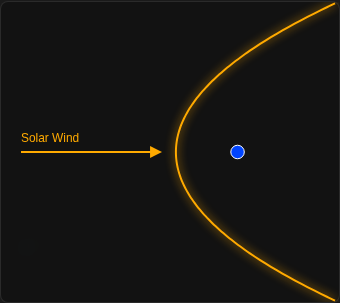
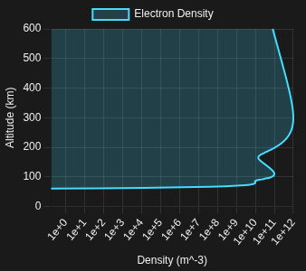

# Alfven

**Alfven** is a computational toolkit and interactive dashboard for **EF2240 Space Physics**. It bridges the gap between theoretical magnetohydrodynamics (MHD) and observable space weather through a highly visual, web-based interface.

The project features a **Space-Themed Glassmorphism UI**, where floating, translucent panels sit atop a live animated starfield, allowing students to manipulate plasma parameters and visualize the Earth's magnetic shield in real-time.

## 📚 Syllabus Mapping (EF2240)

This project strictly adheres to the course learning outcomes:

| Module | Syllabus Topic | Implemented Features |
| --- | --- | --- |
| **Plasma State** | *Define and classify plasmas* | Calculator for **Debye Length** ($\lambda_D$), **Plasma Frequency** ($\omega_{pe}$), **Larmor Radius** ($r_L$), electron thermal speed, gyrofrequency, temperature conversion, and collective-plasma classification. |
| **MHD Waves** | *Typical properties of space plasmas; model phenomena using basic physical laws* | **Alfvén Speed** ($v_A$) and **Alfvén Mach Number** ($M_A$) calculator for proton-dominated solar-wind plasma. |
| **The Sun** | *Sun and solar wind* | **Parker Spiral** model for the Interplanetary Magnetic Field (IMF) and sunspot temperature estimation. |
| **Magnetosphere** | *Model the form of the magnetosphere* | **Chapman-Ferraro** distance calculator to determine Magnetopause location ($R_{mp}$) under solar wind pressure. |
| **Ionosphere** | *Origin, structure and dynamics* | **Chapman Layer** profiling with Electron Density ($N_e$), peak altitude, peak density, and vertical total electron content (**TEC**) for D, E, and F layers. |
| **Aurora** | *Power dissipated in the aurora* | Current sheet estimation and Joule heating calculations for geomagnetic storms. |

## 📊 Visualizations & Artifacts

### 1. The Magnetosphere (Interactive Field Tracing)

*A D3.js visualization modeling the compression of Earth's magnetic field by the Solar Wind dynamic pressure. Users can adjust solar wind velocity and density via glass sliders.*

**Code:**

```python
from alfven.magnetosphere import Magnetopause

# Solar Wind Conditions (Normal vs Storm)
normal = Magnetopause(density=5e6, velocity=400e3) # 5 cm^-3, 400 km/s
storm  = Magnetopause(density=20e6, velocity=800e3) # CME Impact

print(f"Normal Standoff: {normal.radius_re:.1f} Re")
print(f"Storm Standoff:  {storm.radius_re:.1f} Re")

```

**Artifact Output:**



> *Figure 1: The Magnetosphere Standoff. The visualization renders the "Standoff Distance" where the solar wind dynamic pressure balances the Earth's magnetic pressure. Under storm conditions (red line), this boundary moves inward, potentially exposing geostationary satellites (dotted circle) to the magnetosheath plasma.*

### 2. Ionospheric Profiling (Chapman Layers)

*An interactive altitude profile showing how UV radiation creates the D, E, and F layers. The UI allows toggling "Day" vs "Night" modes to see the decay of the D-layer.*

**Code:**

```python
from alfven.ionosphere import ChapmanLayer

# Create E-layer (peak at 110km) and F-layer (peak at 300km)
e_layer = ChapmanLayer(h0=110, H=10, n_max=1e11)
f_layer = ChapmanLayer(h0=300, H=50, n_max=1e12)

profile = e_layer + f_layer
profile.plot_altitude_profile(0, 600)

```

**Artifact Output:**



> *Figure 2: Ionospheric Layers. The plot shows Electron Density ($N_e$) vs Altitude ($h$). The distinct E and F layers are visible. The dashboard uses semi-transparent fills to represent plasma density, adhering to the glassmorphism theme.*

The profile card also derives three compact diagnostics from the modeled altitude samples:

- peak electron density in $m^{-3}$;
- altitude of the density maximum in km;
- vertical total electron content in TECU, calculated by trapezoidal integration from 60 to 600 km.

### 3. Solar Wind (Parker Spiral)

*A top-down view of the solar system showing the spiral structure of the Interplanetary Magnetic Field (IMF).*

**Artifact Output:**

> *Figure 3: The Parker Spiral. Because the Sun rotates, the magnetic field lines frozen into the radially expanding solar wind are wound into an Archimedean spiral. The visualization animates plasma parcels traveling outwards along these field lines.*

### 4. Sunspot Temperature (Solar Physics)

*Estimates the temperature of a sunspot ($T_{spot}$) based on its intensity contrast ratio ($I_{spot}/I_{phot}$) with the surrounding photosphere ($T_{phot} \approx 5778K$). Includes a dynamic visualization of the sunspot darkening.*

**Artifact Output:**


> *Figure 4: Sunspot Temperature. A dynamic visualization of sunspot darkening.*

### 5. Aurora Power (Auroral Physics)

*Calculates the total power dissipated in the auroral ionosphere and the height-integrated sheet current, given the ionospheric electric field ($E$), Pedersen conductivity ($\Sigma_P$), and the area of the active region.*

### 6. Alfvén Speed and Flow Regime

*Calculates the ideal-MHD Alfvén speed for a proton-dominated plasma from magnetic-field strength and ion density:*

$$v_A = \frac{B}{\sqrt{\mu_0 n_i m_p}}$$

The dashboard compares the result with a selected bulk-flow speed to calculate the Alfvén Mach number, $M_A = v_{flow}/v_A$, and classifies the flow as sub-Alfvénic or super-Alfvénic. With typical solar-wind values of $n_i=5\,cm^{-3}$ and $B=5\,nT$, the calculator returns approximately $49\,km/s$.

### 7. Expanded Plasma Diagnostics

The Plasma Parameters card now accepts a magnetic-field magnitude and reports electron Larmor radius, electron temperature in kelvin, thermal speed, gyrofrequency, and the number of particles per Debye sphere alongside Debye length and plasma frequency. The latter supports a simple collective-plasma classification tied directly to the course objective of defining and classifying plasmas.

## 🧪 Testing Strategy

### Unit Tests (Fundamental Physics)

Located in `tests/unit/`.

*Example: `tests/unit/test_plasma.py*`

```python
def test_debye_length():
    """
    Verifies Debye Length calculation: lambda_D = sqrt(eps0 * k * Te / (n * e^2))
    """
    from alfven.plasma import PlasmaState

    # Typical Solar Wind: n=5 cm^-3, T=10 eV
    sw = PlasmaState(n=5e6, T_ev=10)

    # Expected: ~10 meters
    assert abs(sw.debye_length - 10.5) < 1.0

```

### E2E Tests (Space Weather Event)

Located in `tests/e2e/`.

*Example: `tests/e2e/test_storm.py*`

```python
def test_geostationary_exposure():
    """
    E2E Test: Does a severe solar storm compress the magnetopause
    inside Geosynchronous Orbit (6.6 Re)?
    """
    # Simulate Carrington-class event
    storm = Magnetopause(density=50e6, velocity=1200e3, Bz=-20e-9)

    # If radius < 6.6 Re, satellites are in the magnetosheath
    assert storm.radius_re < 6.6

```

## ⚖️ License

**MIT License**

Copyright (c) 2026 Dhruv Haldar
